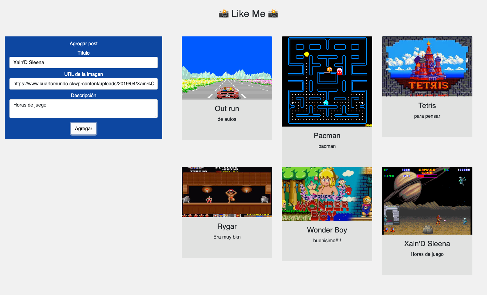

# Desafío "Like Me 👍"

## Descripción

- Se requiere que el servidor interactúe con una base de datos postgresql para guardar y consultar los posts.
- Es un desafío de la carrera de Desarrollo Web Full Stack.



### Características

- Se crea un servidor que disponibiliza las rutas GET y POST para consultar y guardar los posts en una base de datos de postgresql.
- El servidor corre en el puerto localhost:3000.
- Versión node v18.16.0

### Instalación

```
$ npm install
```

### Dependencias

- express ^4.18.2
- nodemon ^2.0.22
- cors ^2.8.5
- dotenv ^16.0.3
- pg ^8.11.0

### Iniciar el servidor

```
$ npm run dev
```

### Endpoints

- GET /posts
- POST /posts
